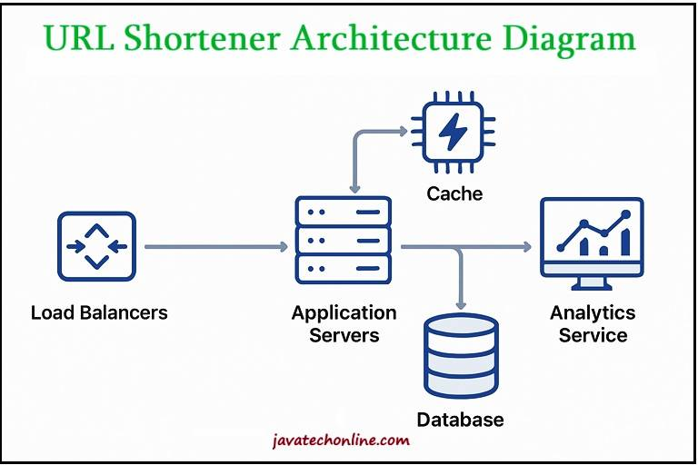

# URL Shorten from Treesdoo

## Description

The service will take the long URL and turn into shortened URL that can be remembered. When user accesses the shortened URL, it will redirect user to original one.

## Problem Statement

Design a URL shortener service that converts:

– long URLs into short, unique aliases

– redirects users from the short URL to the original long URL

– provides analytics on URL usage

– Handles high traffic volumes efficiently

– Ensures shortened links are not easily predictable

## Requirements Analysis

### Functional Requirements

- URL Shortening: Given a long URL, the service should generate a unique, shorter URL. For example, turning <https://www.example.com/very/long/path/to/resource> into <https://short.ly/abc123>

- URL Redirection: When a user accesses the shortened URL, they should be redirected to the original URL quickly and reliably.

- Link Expiration: URLs should expire after a default time period (configurable). This helps manage storage and ensures outdated links don’t persist forever.

- Custom URLs: Users should be able to create custom short URLs (optional). For example, <https://short.ly/my-brand> instead of a randomly generated string.

- Analytics: The service should track usage statistics like click count, geographic location, and referrer. This provides valuable data to users about their link

- User Accounts: Registered users can manage their shortened URLs, view analytics, and customize settings.

### Non-Functional Requirements

- High Availability: The service must be highly available, as URL redirection failures would break links across the internet. We should aim for 99.99% uptime.

- Low Latency: Redirection should happen with minimal delay (< 100ms). Users expect clicking a link to be nearly instantaneous.
  
- Scalability: The system should handle millions of URL creations and billions of redirections. Popular links might receive massive traffic spikes.

- Security: Short URLs should not be easily guessable or predictable to prevent unauthorized access to potentially sensitive links.

-Reliability: Once created, a short URL should consistently redirect to the correct destination throughout its lifetime.

## Capacity Estimation

Let’s estimate the scale of our system to better understand the resources we’ll need:

### Traffic

Assuming 100 million new URL shortenings per month and a 200:1 read/ write ratio, we get:

- URL creation: ~40 URLs/second (100 million ÷ (30 days × 24 hours × 3600 seconds))

- URL redirection: ~8,000 URLs/second (40 × 200)

### Storage

If we store each URL entry with metadata (approximately 500 bytes) for 5 years:

- 100 million URLs/month × 60 months = 6 billion URLs

- 6 billion URLs × 500 bytes = ~3 TB of storage

### Memory

Using the 80/20 rule (80% of traffic goes to 20% of URLs):

- Daily redirections: 8,000/second × 86,400 seconds = ~700 million

- Caching 20%: 2 × 700 million × 500 bytes = ~70 GB of cache

## System Components and Architecture

### High-Level Design

Our URL shortening System Design will consist of these key components:

- Application Servers: Handle API requests for URL shortening and redirection

- Database: Store mappings between short and long URLs

- Cache: Store frequently accessed URLs to reduce database load

- Analytics Service: Track and store usage statistics

- Load Balancers: Distribute traffic across application servers

Here is a simplified architecture diagram:



### Data Model Design

We need to store the mapping between short URLs and original URLs. A simple schema might look like:

#### Table: url_mappings

| Field Name | Data Type | Constraints | Description |
|------------|-----------|-------------|-------------|
| short_key | varchar(7) | PRIMARY KEY | The unique key for the short URL |
| original_url | varchar(2048) | | The original long URL |
| created_at | timestamp | | When the mapping was created |
| expires_at | timestamp | | When the mapping expires |
| user_id | varchar(128) | | ID of the user who created the URL (if registered) |
| click_count | int | | Number of times the URL was accessed |

#### Table: analytics

| Field Name | Data Type | Constraints | Description |
|------------|-----------|-------------|-------------|
| short_key | varchar(7) | FOREIGN KEY | Reference to the short URL |
| access_time | timestamp | | When the URL was accessed |
| user_agent | varchar(512) | | Browser/device information |
| ip_address | varchar(45) | | IP address of the requester |
| referrer | varchar(1024) | | Where the request came from |
| location | varchar(128) | | Geographic location based on IP |

### Relationships

- `analytics.short_key` → `url_mappings.short_key` (Foreign Key relationship)

### API Design

Our service will expose these primary endpoints:

#### Create Short URL

```bash
POST /api/shorten 
Request:
{ 
  "original_url": "https://www.example.com/very/long/path",
  "custom_alias": "mylink", // Optional
  "expiration_days": 30 // Optional 
} 
Response:
{ 
   "short_url": "https://short.ly/abcdef", 
   "original_url": "https://www.example.com/very/long/path", 
   "expires_at": "2023-06-01T00:00:00Z", 
   "statistics": { "url":"https://short.ly/stats/abcdef" }
}
```

#### Redirect to Original URL

GET /{short_key} Response: HTTP 302

Redirect to original URL

#### Get URL Statistics

```bash
GET /api/stats/{short_key} 
Response:
{
   "short_url": "https://short.ly/abcdef", 
   "original_url": "https://www.example.com/very/long/path", 
   "created_at": "2023-05-01T00:00:00Z", 
   "click_count": 42, 
   "top_referrers": [...], 
   "top_locations": [...], 
   "daily_clicks": [...] 
}
```

## URL Encoding Techniques

The core challenge in a URL shortener is generating short, unique keys. Let’s explore two common approaches:

### Base62 Encoding

Base62 uses alphanumeric characters (a-z, A-Z, 0-9) to represent numbers in a more compact form:

- With 7 characters, we can generate 62^7 ≈ 5 trillion unique URLs

- This is more than sufficient for our estimated 6 billion URLs

The process works like this:

1. Generate a unique identifier (e.g., auto-incrementing ID or UUID)

2. Convert this identifier to base62

3. Use the result as the short key

### MD5 Hashing

Another approach is to use cryptographic hashing:

1. Generate an MD5 hash of the original URL

2. Take the first 7 characters of the hash

3. Check for collisions in the database

4. If a collision exists, try a different portion of the hash or add a random character

This approach has a higher risk of collisions but can be mitigated with proper collision handling.

## Scaling Considerations

### Database Sharding

As our system grows, we will need to distribute our database across multiple servers. We can shard based on:

- Short Key: Use consistent hashing to distribute keys across database servers

- Creation Date: Shard by when the URL was created

- User ID: For registered users, shard by user ID

Sharding helps us overcome the limitations of a single database server and scale horizontally.

### Caching Strategy

To handle the high read load:

– Implement a multi-level caching strategy

– Use in- memory caches like Redis or Memcached

– Cache the most frequently accessed URLs

– Set appropriate TTL (Time To Live) values based on URL popularity

Effective caching can dramatically reduce database load and improve response times.

### Load Balancing

To distribute traffic evenly:

– Use round-robin DNS or hardware load balancers

– Implement health checks to route traffic away from failing servers

– Consider geographic load balancing for global users

Load balancing ensures no single server becomes a bottleneck and improves overall system reliability.

## Fault Tolerance and Recovery

To ensure high availability:

– Replicate data across multiple database servers

– Implement database failover mechanisms

– Use multiple data centers for disaster recovery

– Regularly backup data and test restoration procedures

These measures help maintain service even when components fail.

## Solution Walkthrough

Let’s walk through the complete flow of our URL shortener:

### URL Creation

- User submits a long URL through the API

- System validates the URL (checks format, blacklisted domains, )

- System generates a unique short key using base62 encoding

- The mapping is stored in the database and cache

- The short URL is returned to the user

### URL Redirection

- User clicks on a short URL

- Request goes through load balancer to an application server

- Server checks the cache for the short key

- If found, it returns a 302 redirect to the original URL

- If not in cache, it queries the database, updates the cache, and redirects

- Analytics data is recorded asynchronously

### Analytics Processing

- Redirection events are sent to a queue

- Analytics workers process events from the queue

- Data is aggregated and stored for reporting

- Real-time dashboards are updated

This design provides a scalable, reliable URL shortening service that can handle millions of users while maintaining low latency and high availability.

## Common Pitfalls and How to Avoid Them

### Database Overload

In a URL Shortening System Design, frequent lookups and writes can overwhelm the database. To avoid this, implement aggressive caching using systems like Redis, and use asynchronous processing for writes to minimize database pressure.

### Short Key Collisions

Since shortened URLs are generated from a limited character set, key collisions can occur. A robust URL Shortening System Design must include collision detection mechanisms such as retries with unique identifiers or hash-based key generation strategies.

### Security Issues

Allowing users to shorten arbitrary URLs can lead to the spread of malicious links. To mitigate this in a URL Shortening System Design, validate target URLs against blacklists and implement rate-limiting or CAPTCHA to prevent automated misuse.

### Performance Bottlenecks

Scalability is a critical factor in URL Shortening System Design. Regularly monitor performance metrics and ensure that bottlenecks are addressed by scaling specific components like load balancers, cache servers, or databases as needed.

### Data Loss

Loss of shortened URL mappings can disrupt user access to resources. A well-designed URL Shortening System includes regular database backups, replication, and cross-datacenter data synchronization to ensure high availability and disaster recovery.

## System Design

### Frontens

- Vanilla JS

### Backend

- Python (Flask)

### Database

- Firebase

## References

- [javatechonline](https://javatechonline.com/url-shortening-system-design-tiny-url/)
